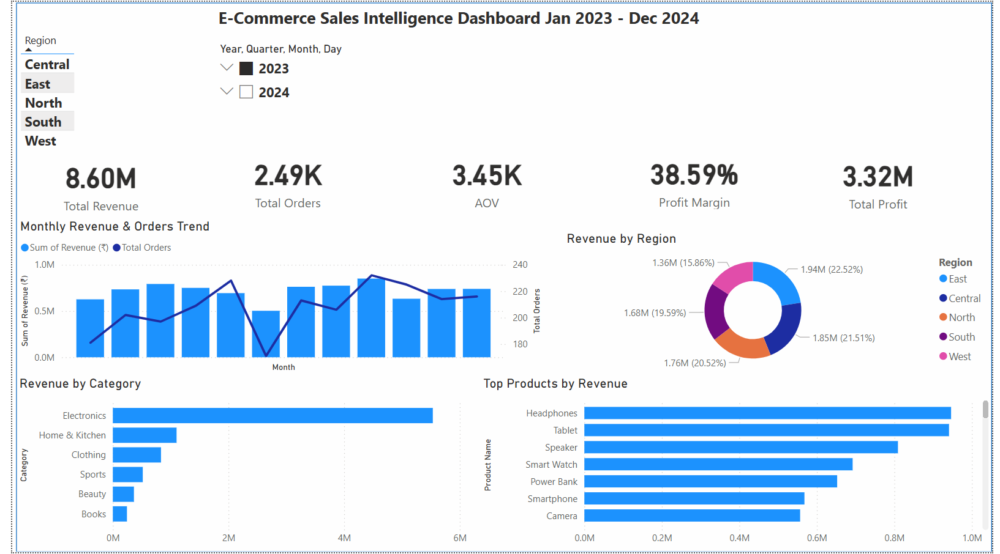
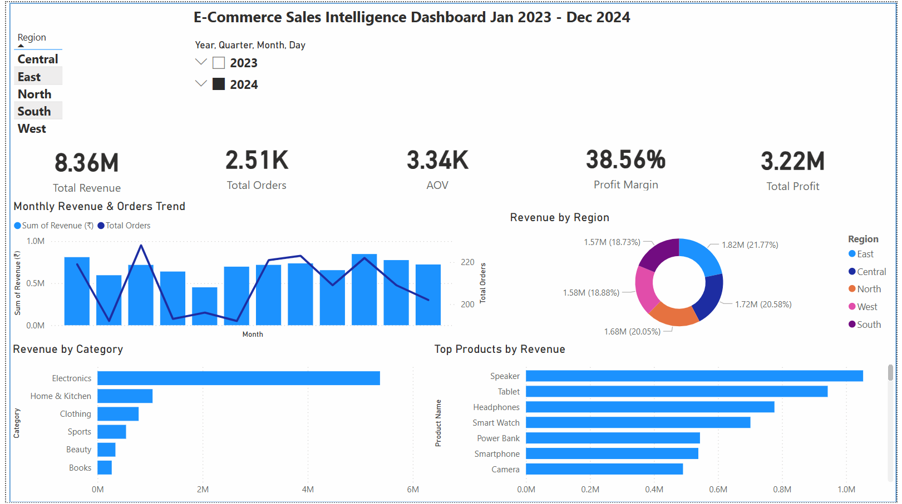

# E-Commerce Sales Intelligence Dashboard

## Dashboard Overview


---

## Project Overview

This Power BI dashboard provides a comprehensive analysis of E-Commerce sales performance from January 2023 to December 2024.

The dashboard enables users to monitor revenue, orders, profitability, regional performance, category performance, and top-selling products through interactive visualizations and filters.

---

## Business Objectives

- Analyze overall sales performance
- Track monthly revenue and order trends
- Measure business profitability
- Compare regional sales contribution
- Identify top-performing product categories
- Discover best-selling products
- Support data-driven business decisions

---

## Key Performance Indicators (KPIs)

| Metric | Value |
|----------|----------|
| Total Revenue | ₹16.96M |
| Total Orders | 5,000 |
| Average Order Value | ₹3.39K |
| Profit Margin | 38.57% |
| Total Profit | ₹6.54M |

---

## Dashboard Features

### Revenue & Orders Trend
Tracks monthly revenue and order volume performance over time.

### Revenue by Region
Visualizes revenue contribution across different regions.

### Revenue by Category
Highlights category-wise sales performance.

### Top Products by Revenue
Identifies products generating the highest revenue.

### Interactive Filters
- Region Filter
- Year Filter (2023 & 2024)

---

## Tools Used

- Power BI
- Microsoft Excel
- DAX
- Data Modeling
- Data Visualization

---

## Dataset Information

The dataset contains:

- Order Details
- Product Information
- Customer Information
- Revenue Data
- Profit Data
- Regional Data
- Category Data

Time Period:
**January 2023 – December 2024**

---

## Project Structure

```
Ecommerce-sales-intelligence-dashboard/
│
├── Ecommerce dashboard.pbix
├── ECommerce_Clean_Dataset_2026.xlsx
├── PowerBI_Dashboard_ECommerce_2026_RealData.html
│
├── dashboard_overview.png
├── dashboard_2023.png
├── dashboard_2024.png
│
└── README.md
```

---

## Dashboard Snapshots

### Complete Dashboard

)

### Dashboard - 2023 Analysis



### Dashboard - 2024 Analysis



---

## Key Insights

- Electronics generated the highest revenue among all categories.
- East region contributed the largest revenue share.
- Tablets and Speakers were the top-performing products.
- Revenue remained consistent throughout the analysis period.
- Profit margin exceeded 38%, indicating strong profitability.

---

## Conclusion

This dashboard demonstrates the use of Power BI for business intelligence, KPI tracking, trend analysis, and sales performance monitoring. It helps stakeholders identify growth opportunities and make informed decisions using data-driven insights.
